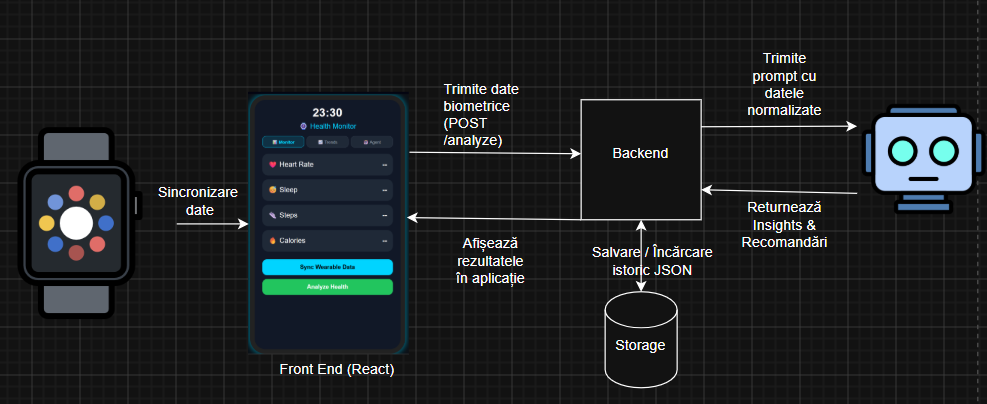

# Health Monitor AI

# Despre Proiect

Realizat pentru monitorizarea stării de sănătate, folosind date provenite de la un smartwatch și tehnici AI.
---
# Problema abordată:
## Probleme majore în societate:
- sedentarismul
- lipsa somnului de calitate
- ritm cardiac neregulat
## Scopul proiectului este de a atrage atenția asupra riscurilor de sănătate produse de aceste probleme, dar și de a face aceste date ușor de înțeles/ urmărit
## De asemenea, aplicația oferă recomandări personalizate pentru îmbunătățirea stilului de viață
---
Aplicația analizează date precum:
  - ritmul cardiac
  - somnul
  - nivelul de stres
  - numărul de pași

și oferă recomandări privind starea de sănătate a utilizatorului, folosind tehnici de procesare și analiză a datelor.

---
# Funcționalități
- Monitorizarea ritmului cardiac
- Analiza calității somnului
- Monitorizarea activității fizice
- Calcularea unui Health Score
- Vizualizarea indicatorilor de sănătate
- Analiza tendințelor în timp
- Recomandări pentru îmbunătățirea stilului de viață
---
# Tehnologii folosite

## Backend
- Python (Flask)
- Ollama (Model: Mistral) pentru inteligență artificială locală

## Frontend
- React.js + Vite
- CSS customizat pentru interfața stil "SmartWatch"

## Pachete și Analiză Date
- Pandas, Matplotlib, JSON, Requests

---
# Licență

  Proiect realizat în scop educațional.
  
---

# Fluxul aplicației
1. Utilizatorul introduce date biometrice provenite de la smartwatch.
2. Datele sunt validate și normalizate.
3. Sistemul analizează ritmul cardiac, somnul și activitatea fizică.
4. Se calculează un Health Score.
5. Datele sunt salvate pentru analiză ulterioară.
6. Dashboard-ul afișează rezultatele și recomandările.


---
# [Logica algoritmilor health score](https://colab.research.google.com/drive/1VPU3vWQXJq8k8JEKiI8DZLiduVv6XRz3?usp=sharing)
---
# Arhitectura Proiectului

```text
AI_PROJECT/
│
├── .venv/                  # Mediul virtual Python
├── analize/                # Modulele de procesare matematică și AI
│   ├── analysis.py         # Calculul scorului și clasificarea datelor
│   ├── health_agent.py     # Prompt-ul și integrarea cu Ollama
│   ├── report_generator.py # Rapoarte statistice săptămânale
│   └── trend_analysis.py   # Calculul trendurilor pe termen lung
├── backend/
│   └── app.py              # Serverul Flask API
├── data/
│   └── health_data.json    # Baza de date locală
├── frontend/               # Interfața grafică (Aplicația React)
│   ├── src/
│   ├── index.html
│   ├── package.json
│   └── ...
├── service/
│   └── agent_service.py    # Wrapper-ul pentru serviciul AI
├── storage/
│   ├── storage.py          # Logica de scriere/citire JSON
│   └── utils.py            # Validarea și normalizarea datelor
├── requirements.txt        # Dependențele Python
└── README.md
```
---
# Instalarea și Pornirea Aplicatiei

## Requirements
- Node.js instalat (pentru Frontend)
- Python 3.x instalat (pentru Backend)
- Ollama pornit local cu modelul mistral (`ollama run mistral`)
- ## Clonarea proiectului
   - git clone [link_git]
   - cd AI_PROJECT
- ## Instalarea dependențelor de Backend
   - ## Activarea mediului virtual local
      - .\.venv\Scripts\activate
   - ## Instalarea librăriilor din requirements.txt
      - .\.venv\Scripts\python.exe -m pip install -r requirements.txt
- ## Instalarea dependențelor de Frontend (React)
   - cd frontend
   - npm install


## Pornire Backend (Flask)
  - run backend/app.py
  - va apărea o linie: "Running on [link]"
  - accesează linkul
  - se va deschide o fereastră în browser cu mesajul "Health Monitor API is running!"
## Pornire Frontend
  - intră în terminalul Python
  - scrie următoarele linii:
     - cd frontend
     - npm run dev
  - în terminal va apărea linia: "Local: [Link]"
  - accesează linkul
  - se va deschide o fereastră în browser cu interfața Smart Watch-ului
---
# Contributors
- [ungureanuIrinuca](https://github.com/ungureanuIrinuca)
- [Deny0511](https://github.com/Deny0511)
- [elenasotoc5](https://github.com/elenasotoc5)
- [andreimihnea05](https://github.com/andreimihnea05)
---

# teaser (demo)
https://youtu.be/NJrSdp2E2A8

# prezentare tema proiect
https://youtu.be/Tz9VVSLCLSk
